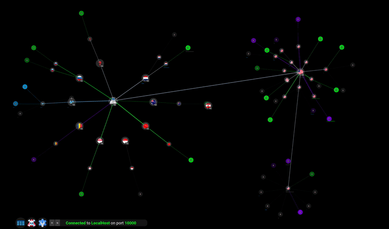

# Network Visualizer

Network Visualizer is a open-source tool that allows everyone - not just security professionals - to visualize their computers network connections. Additional methods are in development to mitigate malicious activity from unwanted network connections. Network Visualizer compliments existing security methods and will grow in sophistication over time.    

  

 

Promotional Video: https://www.youtube.com/watch?v=jpIFm8byyqY

Walkthrough Video: https://www.youtube.com/watch?v=suKNbLfNQZU

 

# Donate

Network Visualizer is 100% funded through donations — which is none so far at the time of this writing. 🙃   

Your donation would facilitate the development of open source tools to serve you. Thank you!
 

Venmo 
https://account.venmo.com/u/TinkeringEngr

BTC Wallet 
bc1qy5ejsgsslgag32ddzjww3mrkwsr9v5avx9swz2

ADA Wallet 
addr1q9vhvts97guem5njwqwlwnhd5lajacqdegqn93nhayz78zjewchqtu3enhf8yuqa7a8wmflm9msqmjspxtr806g9uw9q8vz0xn

XRP Wallet 
rwgWYtUfVRL92aTquMiXqeUBqTfYxmhcSc

If your crypto of choice isn't listed, please let me know.

  

# Download (64-bit)

Run with administrator privileges -- future changes will be forthcoming regarding elevated privileges.

## Linux

[Network-Visualizer-Linux.zip](https://downloads.sourceforge.net/project/network-visualizer/Network-Visualizer-Linux.zip?ts=gAAAAABjQMvTemYIWhxVXFcMzt2vD4S76_1Kst7IQKiYg2cIk8rxF6nIeWDO6KK1ulcNaAbSyWZsvVI8uNSEl1eMbXELOHZ_jg%3D%3D&r=https%3A%2F%2Fsourceforge.net%2Fprojects%2Fnetwork-visualizer%2Ffiles%2FNetwork-Visualizer-Linux.zip%2Fdownload)

## Windows

[Network-Visualizer-Windows.zip](https://downloads.sourceforge.net/project/network-visualizer/Network-Visualizer-Windows.zip?ts=gAAAAABjQMu-Gf7sGTDS-JzX4DPCZ9wfwmbkszcTBtpRwNORVfhGxlG9m5zM3ssQQeHAEeUfuBnUcOAa2QozZFLjJorQHtDOaA%3D%3D&r=https%3A%2F%2Fsourceforge.net%2Fprojects%2Fnetwork-visualizer%2Ffiles%2FNetwork-Visualizer-Windows.zip%2Fdownload)

## MacOS

[Network-Visualizer-Mac.dmg](https://downloads.sourceforge.net/project/network-visualizer/Network-Visualizer-Mac.dmg?ts=gAAAAABjQMtx-OLYP--cfon2efFTRldBq_2p47jLnnp8c1I5YzpipUS3WKec3HmPYyIbIja6eOdjCDjgmxRqXs3vdDVOxLQgzQ%3D%3D&r=https%3A%2F%2Fsourceforge.net%2Fprojects%2Fnetwork-visualizer%2Ffiles%2FNetwork-Visualizer-Mac.dmg%2Fdownload)

  
If there is a problem, search [github issues](https://github.com/TinkeringEngr/Network-Visualizer/issues) for the resolution and if not, please submit a github issue with as much detail as possible to replicate/diagnose the issue. 
   

# Running Source Code From Terminal
 

1.  `Install Python3`  
      I use Python version 3.9.6 — your results may vary.   

## Linux & MacOS
 

2.  `git clone https://github.com/TinkeringEngr/Network-Visualizer.git`  
3.  `pip install -r requirements.txt`   

If the computer gods have smiled upon you, run the program with administrator privileges   `sudo python network_visualizer.py`  

If there is a problem, search [github issues](https://github.com/TinkeringEngr/Network-Visualizer/issues) for the resolution and if not, please submit a github issue with as much detail as possible to replicate/diagnose the issue.   

## Windows
 

Be sure Microsoft Visual C++ 14.0 or higher is installed and Python is linked to it (i.e. add Python and Python/Scripts to the PATH variable)   

2.  `git clone https://github.com/TinkeringEngr/Network-Visualizer.git`  
3.   Delete pcapy-ng from the requirements.txt file  
4.  `pip install -r requirements.txt`  
5.  Install [Npcap](https://npcap.com/dist/) and download the SDK files [Npcap SDK 1.12](https://npcap.com/dist/npcap-sdk-1.12.zip)
6.  Install pcapy-ng with the Npcap SDK files linked explicitly.  Like the following example:   `pip install pcapy-ng --global-option=build_ext --global-option="-LC:\PATH\TO\npcap-sdk-1.12\Lib\x64" --global-option="-IC:\PATH\TO\npcap-sdk-1.12\Include\pcap"`   

If the computer gods have smiled upon you, run the program with administrator privileges  `python network_visualizer.py`   

If there is a problem, search [github issues](https://github.com/TinkeringEngr/Network-Visualizer/issues) for the resolution and if not, please submit a github issue with as much detail as possible to replicate/diagnose the issue. 

