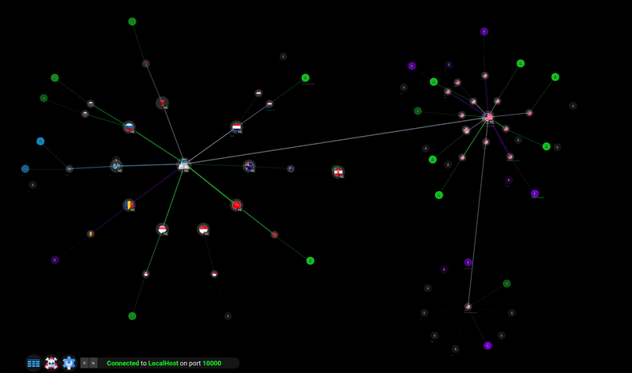

# Network Visualizer

Network Visualizer is a open-source tool that allows everyone - not just security professionals - to visualize their computers network connections. Additional methods are in development to mitigate malicious activity from unwanted network connections. Network Visualizer compliments existing security methods and will grow in sophistication over time.    

  

 

 

# Help The Work Move Forward

My work is 100% funded through donations — which is none so far at the time of this writing. 🙃   

If you are financially able, your donation would allow me to hire a team to build open-source tools to serve you. If so, be sure to send me an email (TinkeringEngr at protonmail.com) with a screenshot of your donation; I would like to attribute those who are supporting the work.
 

Venmo 
https://account.venmo.com/u/TinkeringEngr

BTC Wallet Address 
bc1qy5ejsgsslgag32ddzjww3mrkwsr9v5avx9swz2

If your crypto of choice isn't listed, please let me know.

  

# Download Binary Packages (64-bit)

## Linux

## Windows

[Network_Visualizer.exe](https://downloads.sourceforge.net/project/network-visualizer/network_visualizer.exe?ts=gAAAAABij2mkUue68yxTA0dIQ5HVB841wdfbu0GT_uPSy7xShG8IqzxzKbiPN1uOVKHcoCShvj3TgjSGsW-U3Q6E9DA_YdAGCQ%3D%3D&r=https%3A%2F%2Fsourceforge.net%2Fprojects%2Fnetwork-visualizer%2Ffiles%2Fnetwork_visualizer.exe%2Fdownload)

## MacOS
 
Currently Apple forces developers to pay a fee in order to distrbute software on their system. The way around this overreach is to download the binary via terminal. 
 
 1.`cmd + space` to open MacOS Spotlight  
 2. Type `terminal` and hit enter   
 3. Paste this command into the terminal `cd ~ && curl -L https://sourceforge.net/projects/network-visualizer/files/Network%20Visualizer.app.zip/download --output network_visualizer.zip` 

The `network_visualizer.zip` file will be in the home directory. You can unzip the application and move it to your desired location using Finder. 

  
# Running Source Code From Terminal
 

1.  Install ~ `Python 3.9.11`  
      I've had issues with pip when installing 3rd party libraries using Python 3.6 and 3.10 — your results may vary.   

## Linux & MacOS
 

2.  `git clone https://github.com/TinkeringEngr/Network-Visualizer.git`  
3.  `pip install -r requirements.txt`   

If the computer gods have smiled upon you, run the program with administrator privileges   `sudo python network_visualizer.py`   

## Windows
 

Be sure Microsoft Visual C++ 14.0 or higher is installed and Python is linked to it — add Python and Python/Scripts to the PATH variable.   

2.  `git clone https://github.com/TinkeringEngr/Network-Visualizer.git`  
3.   Delete pcapy-ng from the requirements.txt file  
4.  `pip install -r requirements.txt`  
5.  Download [Npcap SDK 1.12](https://npcap.com/dist/npcap-sdk-1.12.zip)
6.  Install pcapy-ng with the Npcap SDK files linked explicitly.  Like the following example:   `pip install pcapy-ng --global-option=build_ext --global-option="-LC:\PATH\TO\npcap-sdk-1.12\Lib\x64" --global-option="-IC:\PATH\TO\npcap-sdk-1.12\Include\pcap"`   

If the computer gods have smiled upon you, run the program with administrator privileges  `python network_visualizer.py`   

